# Google Analytics Capstone 

# Ask
#### Scenario

You are a junior data analyst working in the marketing analyst team at Cyclistic, a bike-share company in Chicago. The director of marketing believes the company’s future success depends on maximizing the number of annual memberships. Therefore, your team wants to understand how casual riders and annual members use Cyclistic bikes dierently. From these insights, **your team will design a new marketing strategy to convert casual riders into annual members**. But first, Cyclistic executives must approve your recommendations, so they must be backed up with compelling data insights and professional data visualizations.

Three questions will guide the future marketing program:
1. **How do annual members and casual riders use Cyclistic bikes differently?**
2. **Why would casual riders buy Cyclistic annual memberships?**
3. **How can Cyclistic use digital media to influence casual riders to become members?**

The answers to these questions will be provided throughout this notebook

### Guiding questions
* **What is the problem you are trying to solve?**

The problem lies in understanding the disparity between members and casual riders, and devising a marketing strategy to encourage casual riders to purchase annual memberships.

* **How can your insights drive business decisions?**

The insights obtained from our analysis can be used by marketing team to effectively convert casual riders into members.

# Prepare

### Guiding questions

* **Where is your data located?**

The data is located in [this kaggle dataset](https://divvy-tripdata.s3.amazonaws.com/index.html)

* **How is the data organized?**

The data is stored in csv files separated by month.

* **Are there issues with bias or credibility in this data? Does your data ROCCC?**

This dataset lacks bias as it represents Cyclistic's own clientele. This data meets the criteria of being reliable, original, comprehensive, current, and cited (ROCCC).

* **How are you addressing licensing, privacy, security, and accessibility?**

The datasets do not contain personal or identifiable client information. And the company is fictional and has their own license over the datasets

* **How does it help you answer your question?**

By cleaning, processing, and analyzing the data, valuable insights about the clients can be obtained, which can aid in answering the guiding questions.

* **Are there any problems with the data?**

There is no problem with this data

#### Data sources used
*The data source is about 12 months (Between february 2023 and january 2024) of riding data provided by the Cyclistic company.*

# Process
Now, it's time to process the data for analysis 

### Guiding questions
* **What tools are you choosing and why?**

I'm using Python3 (even though it's not the tools we learn on the course). The libraries used are matplotlib, pandas and numpy

* **Have you ensured your data’s integrity?**

Yes. Right below it's the process used to guaranteed the data's integrity

* **What steps have you taken to ensure that your data is clean?**

The cleaning process will be described in detail below.

* **How can you verify that your data is clean and ready to analyze?**

We have to insure that there is no duplicates, no null data. We also have to verify the correctness of data types.
 
* **Have you documented your cleaning process so you can review and share those results?**
 
Yes, the detailed cleaning process is documented below.

# Analyze
Now that the data is stored appropriately and has been prepared for analysis, I will begin analyzing it and searching for valuable insights.

### Guiding questions

*  **How should you organize your data to perform analysis on it?**

I concatenated it into one dataframe and created new time-related columns. I also created a new column that shows the duration of each ride

* **Has your data been properly formatted?**

Yes

* **What surprises did you discover in the data?**

I will uncover any surprises in this notebook below.

#### Casual vs Members
Let's see how the data is distributed between members and casual riders

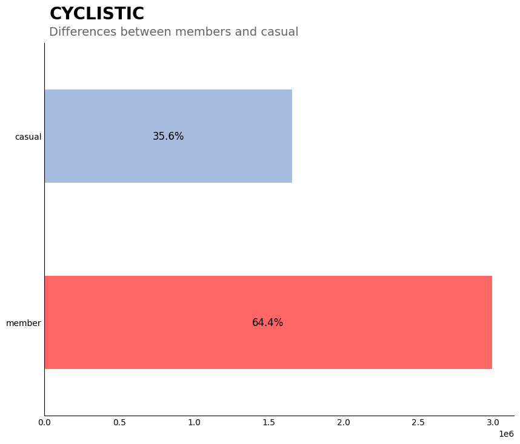

It's notable that there is a huge disparity between members and casual riders. The number of member rides is nearly double than casual riders.

#### Months
Let's see how the data is distributed by month

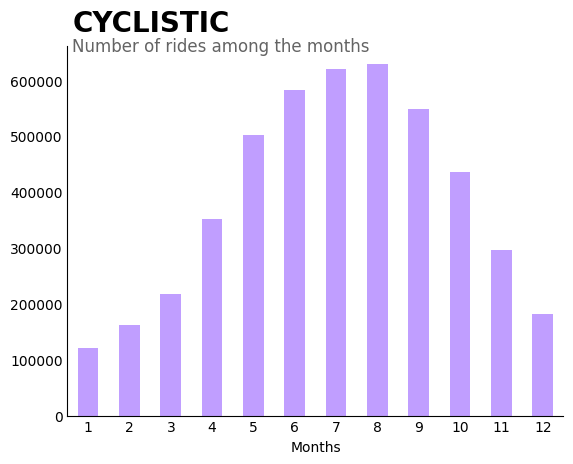

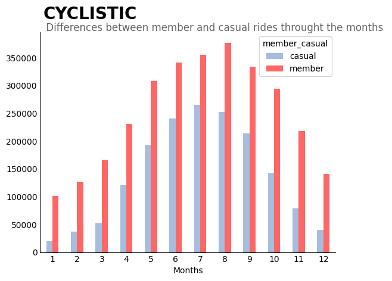

* Both members and casual riders have similar behavior across the months
* The month with more data points was August for members and July for casual riders.

#### Vacation vs Non-vacation
Above, we could see that there are significantly data points on 6th, 7th, 8th and 9th months compared to the others.

I'm Brazilian, I'm not familiar with the vacation months in the USA. According to [this site](https://www.etiaseu.com/articles/when-americans-prefer-travel#:~:text=The%20most%20popular%20time%20of,of%20August%20or%20early%20September.), the summer vacation in USA is  "*mid to late June and return towards the end of August or early September* ". So i used this months to represent vacation and see if there a impact on the data points.

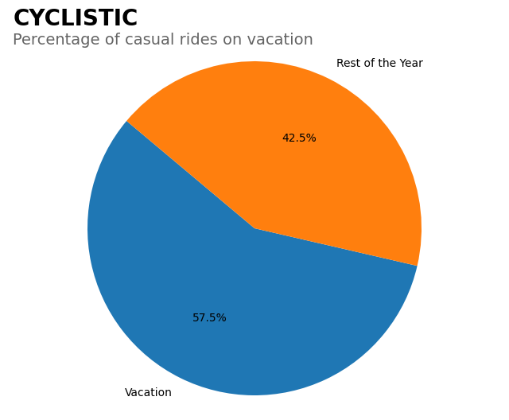

It's evident that there are significanly more rides on vacations months than "non-vacation" months when we look into the casual riders

#### Vacation for members
Let's make the same analysis but for the members rides

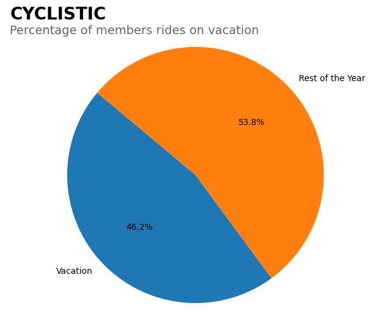

When observing the data for members, it becomes evident that there is a significant concentration of data points during vacation months. In just four months, representing almost 50% of the entire year

#### Weekday
Now, let's see which are the behavior of the data in relation of the weekdays

What we can observe is:

* The highest volume of data occurs on Saturdays.

* The second one is on Thursdays.

* Sunday and Monday have the lowest amount of data.
  

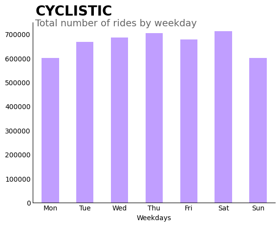

Oh, here we can observe several interesting insights:

* Unlike the overall chart, there is a noticeable difference between members and casual riders in this chart.
 
* Casual riders usually use bikes on Saturdays, Sundays, and Fridays, indicating that they typically ride on weekends.
 
* In contrast, member riders' usage peaks on Thursdays, Wednesdays, and Tuesdays, showing a distinct pattern from casual riders.
 
* Saturdays are the days where both casual and member riders have almost equal usage levels.

#### Hours 
Let's see which are the behavior of the data in relation of the hours

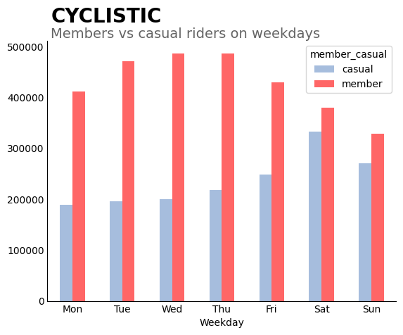

It's interesting to note here that:

* Both members and casual riders has the highest amount of data in the afternoon (specially after 3 p.m)

* The early morning hours, from 0 to 3 a.m, are the only times when there are more casual riders than members.
 
* For members, there are two peaks: in the morning (possibly due to people commuting to work, school, or the gym) and in the late afternoon (possibly as people return from their daytime activities and others head out).

#### Bike type
Let's see which are the behavior of the data in relation of the bike types

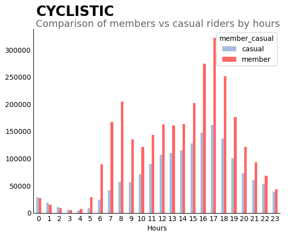

We can see some interesting points here

* Firstly, members uses more classic bikes than the others and avoid docked bikes.
 
* Among casual riders, there is an even split between those who use classic bikes and those who prefer electric bikes, with very few opting for docked bikes.

### Ride time 
Let's see which are the behavior of the data in relation of the ride times

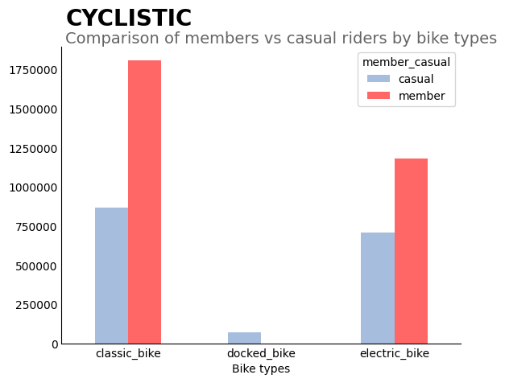

The mean time of a ride of a casual is almost double of the members riders

### Ride time on weekdays

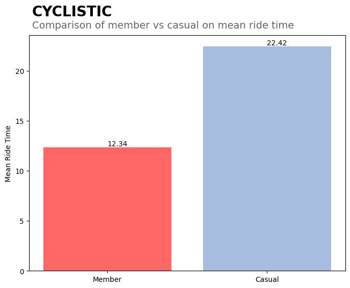

* At the beginning of the week (Monday to Thursday), members typically take longer rides. However, on weekends, casual riders use the bikes for much longer durations.
 
* Members generally exhibit less variation in ride time throughout the week. Casual riders, in the other hand, experience a significant increase in usage on weekends, as mentioned previously.

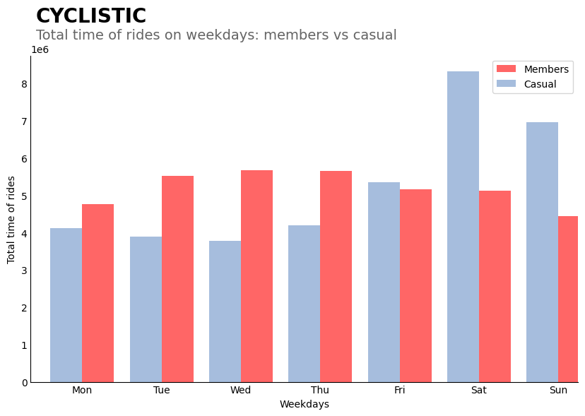

* When we talk about mean time of rides, we have a whole different analysis. Independent of the day, casual riders, on average, uses bikes for longer periods.
 
* Still, Saturday and Sunday casual riders, on average, uses bikes for longer durations. 

* In contrast, members' ride durations do not vary significantly throughout the week.

### Ride time on months

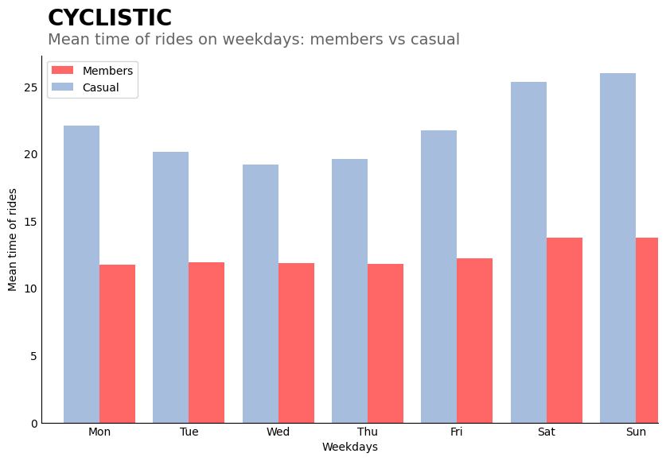

* Here we can observe a consistent pattern throughout the analysis: bike usage peaks during the mid-year months (May to September) for both members and casual riders.

* It's noteworthy that during the mid-year period, there are more casual rides than member rides. However, this trend is not observed during the beginning and end of the year (January to April and October to December).

# Share

After all this work, it's time to share what i've learned from analyzing these databases. But before we do that, let's recap my goal here:

> How do annual members and casual riders use Cyclistic bikes differently?

> Why would casual riders buy Cyclistic annual memberships?

> How can Cyclistic use digital media to influence casual riders to become members?

So, based on that, let's talk about what I find out. 

* The first observation is that we have significantly more data on member riders than on casual riders. 64% of the rides were made by member riders. This indicates that the number of member riders is nearly double that of casual riders.

* Both members and casual riders exhibit the same behavior across the months, which means that the amount of rides increases, proportionally, almost equally thorught the months.

* It's clear that both members and casual riders uses more bikes during months related to summer vacation (June, July, August, September). For casual riders, summer vacation represents ~57% of the rides, while for members riders, it represents 46%

* As mentioned earlier, casual riders use bikes more frequently during the four months of summer vacation compared to the rest of the year. Members exhibit a similar behavior, but their usage is concentrated in just four of the twelve months, representing almost half of their rides.

* The month with more rides was August for members and July for casual riders.

* When considering the weekdays, we observe that the highest volume of data is on Saturdays.

* Sunday and Monday have the smallest amount of data. I suppose that Sunday doesn't have much data because people typically use it as a day to relax and may not go outside or use bikes.

* Casual riders' top three most used days are Saturday, Sunday, and Friday, indicating that they typically use bikes on the weekend.  Probably this happens because people uses bikes for leisure activities on the weekend.

* In contrast, member riders' top three most used days are Thursday, Wednesday, and Tuesday. This pattern may occur because individuals who have paid for an annual membership use bikes frequently, possibly for commuting to work or school. Consequently, the midweek period sees the highest usage among members.

* Saturday is the day where casual and members riders have almost the same amount of rides.

* Both members and casual riders have the highest number of rides in the afternoon, especially after 3 p.m. This coincides with the time when people are returning home from work or school, as well as when others are heading out to work or engaging in their daily routines.

* On early morning is the only moment where has more casual than members riders. ( From 0 a.m to 3 a.m) 

* For member riders, there are two peaks in ride usage: in the morning, which is likely due to people commuting to work, school, or the gym, and in the late afternoon, when people are returning home from school and work, while others are heading out for various activities.

* Members uses more classic bikes than the other types of bike and don't use docked bikes.

* Half of the casual riders use classic bikes, while almost the other half prefer electric bikes, with very few opting for docked bikes.

* The average ride duration of a casual rider is almost double that of a member rider. The average duration of a casual ride is 22 minutes, whereas for a member, it's 12 minutes. Therefore, despite there being more member riders, casual riders use bikes for longer durations.

* At beginning of the week ( Monday to Thursday), members usually takes more time on rides. Otherwise, on weekend, the casual riders uses for much more time the bikes. Which means, as said before, members uses bikes more in midweek and casual uses on the weekend.

* Independent of the day, casual riders, on average, uses bikes for longer periods. 

* Member riders don't vary much in the amount of time they use bikes over the week; they use bikes for almost the same duration throughout the entire week.

* People uses bikes in the mid-year ( May to September) more frequently than the other months. This happens to both members and casual riders

* Mid-year have more casual rides than members rides. This is not true to end and start of the year ( January to April and October to December). This happen probably because people are in vacation and uses the free-time to enjoying biking. In contrast, during the rest of the year, those who have paid for membership are likely to use bikes more frequently due to daily commitments such as work or other activities.

* The most popular stations are:  *Streeter Dr & Grand Ave;  DuSable Lake Shore Dr & Monroe St; Michigan Ave & Oak St; DuSable Lake Shore Dr & North Blvd; Clark St & Elm St; Kingsbury St & Kinzie St; Wells St & Concord Ln; Clinton St & Washington Blvd; Theater on the Lake; Millennium Park*

##### Some conclusions about my analysis:

* **Members use bikes as part of their routine, such as commuting to work, the gym, or school.**
 
* **Casual riders use bikes for leisure, enjoying them during vacations and weekends.**
 
* **Summer vacations are particularly lucrative for the company, as bike usage increases significantly during this period.**

### Guiding Questions

* **Were you able to answer the question of how annual members and casual riders use Cyclistic bikes differently?**

Yes. Analyzing the data made it clear that there are a lot of differences between casual and member riders.

* **What story does your data tell?**

Tell that members uses bikes to mainting a routine and casual uses for leisure.
 
* **How do your findings relate to your original question?**

In every way. My primary task was to identify the fundamental differences between casual and member riders, and I think i did that. Other thing I have to do is to assist the company in using social media to convert casual riders into members, which I plan to address later in this notebook.

* **Who is your audience? What is the best way to communicate with them?**

My audience is the marketing team of the Cyclistic company. Specially Lily and Moreno (specified on the document). The best way to communicate with them is to put all those visualizations on slides and create a apresentation where I show my insights and thoghts.
 
* **Can data visualization help you share your findings?**

Yes. I utilized visualizations wherever I felt they could aid in conveying my insights clearly. I believe it was worthwhile, as it helps in understanding the data and insights I aim to share.
 
* **Is your presentation accessible to your audience?**

I believe so. To make sure everybody could understand what I'm trying to say, all my visualizations have the same template, contrasting colors and legends very clear to help anyone analyzing them

# Act

### My top 3 recommendations

**First**, utilize social media to boost advertising during the summer months. These advertisements could highlight the use of bikes for enjoying nature, having fun days out, visiting parks, all while promoting environmentally friendly and healthy living. Additionally, consider adjusting the membership structure by offering a 2-month membership and promoting it during the summer. Create a promotion where customers receive a discount on subsequent memberships after purchasing the first one. This approach encourages initial purchases for vacations and potentially retains customers for the following months.

**Second**, Cyclistic should focus on two key strategies: organizing exclusive cycling events and introducing a feature-rich community app. Firstly, Cyclistic can host members-only cycling events on weekends at key stations like Streeter Dr & Grand Ave, DuSable Lake Shore Dr & Monroe St, and Michigan Ave & Oak St. These events, managed through the Cyclistic app, will offer unique experiences such as guided scenic rides and friendly competitions. Offering substantial discounts during these events, such as three months of free annual membership, will incentivize casual riders to join as members. Promoting these activities on social media, emphasizing the benefits of biking and socializing, along with a referral system where existing members earn discounts for inviting others, will further enhance community engagement and membership conversion.
Alternatively, but still talking abuot an app, Cyclistic can launch a app enabling users to create and manage their own biking communities. Each group sets a collective goal, like a target number of kilometers ridden, fostering camaraderie among members. Successfully reaching the goal earns all members discounts on the following month's membership fees. Members can invite non-members to join for a trial period, with newcomers receiving discounts on their first month's membership. To maximize visibility, Cyclistic should advertise these features during weekends, capitalizing on the peak bike usage by casual riders. 

**Third**, introduce variable pricing similar to Uber based on the time of use to incentivize biking during non-peak hours. Maintain regular prices during peak hours, such as afternoons when bike usage is highest, but implement a pricing formula to reduce rates during off-peak hours. This strategy encourages bike usage at times when demand is lower, promoting a more balanced utilization of resources.

*(Additional Recommendation)*

Offer weekend discounts on memberships to encourage casual riders to purchase memberships. Promote these discounts exclusively on weekends through social media advertisements. Emphasize the weekend discount in the advertisements and showcase individuals using bikes for leisure activities and commuting with joyous expressions, illustrating the benefits of membership.

### Guiding questions¶
* **Is there additional data you could use to expand on your findings?**

Yes, it would be beneficial to have more information about the users, such as age, gender, weight, etc. This additional demographic data could provide deeper insights into user behavior and preferences, enhancing the analysis.

Having data on the climate conditions at the time of each ride would also be valuable. Understanding how weather patterns may have influenced bike usage could provide context and enrich the analysis.

Indeed, data about the universities and companies along the bike paths would be valuable. This information could help determine if people are using bikes for commuting to or from these institutions, even when they are located farther away. Such insights could provide a clearer understanding of the biking patterns and usage behaviors of individuals in relation to their daily routines and destinations.

# Conclusion

This was my first time creating an entire analysis and portfolio piece. I'm very proud of myself, and I have to thanks Google and The Google Analytics Professional Certificate for teach me a lot of useful information that allows me to create this notebook. It was really fun to work on this project, and I'll remember it forever. 

Thanks for this opportunity and thanks to anyone who read this (especially if you consider hiring me after this)

